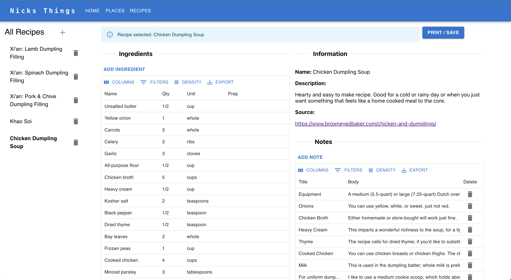

# Info

Personal project to manage my favorite places to go and eat / visit. Requires a free MongoDB Atlas account to run
as well as a Google Maps/Places API key. This should be easy to set up. 

## Home Page


## Places Page


## Recipes Page



Would be nice to add some integration that would allow me to more easily book reservations using this but the Resy API is really expensive.

# Features

### Restaurants & Places to Go

- Add / Remove places from your list
- Add / Remove comments to places that you have been
- Browse all places you have been
- Search all palces you have been
- Drilldown / Filter in table view
- Link out to exact Google results for each place
- Export current selection to a list of places

**TODO:**
- Add a map view to see all the places you have been to
- Add a way to add a review to a place
- Add a way to add a photo to a place
- Add a way to add a reservation to a place
- Bulk import using CSV 
- Add a way to add a place to a list (e.g. "Places to go in NYC")
- Recipe page for users that want to create a recipe book
- Add a way to add a recipe to a place

### Recipes

- Add / Remove recipes from your list
- Add `Ingredients` to your recipe
- Add `Instructions` to your recipe
- Add `Notes` to your recipe

# Setup

You will need to have the following installed:
1. Python and Node installed 
3. npm
4. poetry
5. openapi-generator
6. MongoDB Atlas account
7. Google Maps/Places API key

Plus have the following environment variables set:
```bash
export MONGO_DB_URI="<uri>"
export GOOGLE_MAPS_API_KEY="<api_key>"
```

# Back End

## Install Dependencies and Run:

Ensure that you have all the necessary dependencies installed:
```bash
$ poetry install
```

Run the server from directory root:
```bash
$ poetry run uvicorn service:app --reload
```

Start the cache server from directory root with redis installed and running:
```bash
$ brew install redis
$ redis-server --port 6379
```

# Front End

## Generate Client from Service OpenAPI:

Then generate the client (run from root of this project, not the client directory):
```bash
$ poetry run uvicorn service:app --reload
$ openapi-generator generate -i http://localhost:8000/openapi.json -g typescript-fetch -o my-places/src/api
```

## Install Dependencies and Run:

Ensure that you have all the necessary dependencies installed:
```bash
$ cd my-places && npm install && npm run start
```

You will be able to access the front end at `http://localhost:3000`

# Linting and Formatting 

To lint and format the code, you can run the following commands:
```bash
$ poetry run black .
```

To lint and format the front end code, you can run the following commands:
```bash
$ cd my-places
$ npx eslint src --fix 
$ prettier --write "**/*.ts" --tab-width 4  
```


# Use the API

You can use the API by going to `http://localhost:8000/docs` and using the Swagger UI to interact with the API.

# Using Chat GPT to Generate a Recipe

You can use the chat-gpt to generate a recipe pasting in a screenshot of the recipe and saying "Can you convert this to match this JSON format?" 
```
{
    "name": "Nick's Chicken Parm",
    "description": "Chicken parm recipe.",
    "ingredients": [
        {
            "name": "Chicken Thighs",
            "quantity": "2",
            "measurement": "lbs",
        },
    ],
    "instructions": [
        {
            "step": 1,
            "description": "New Description"
        }
    ]
}
```