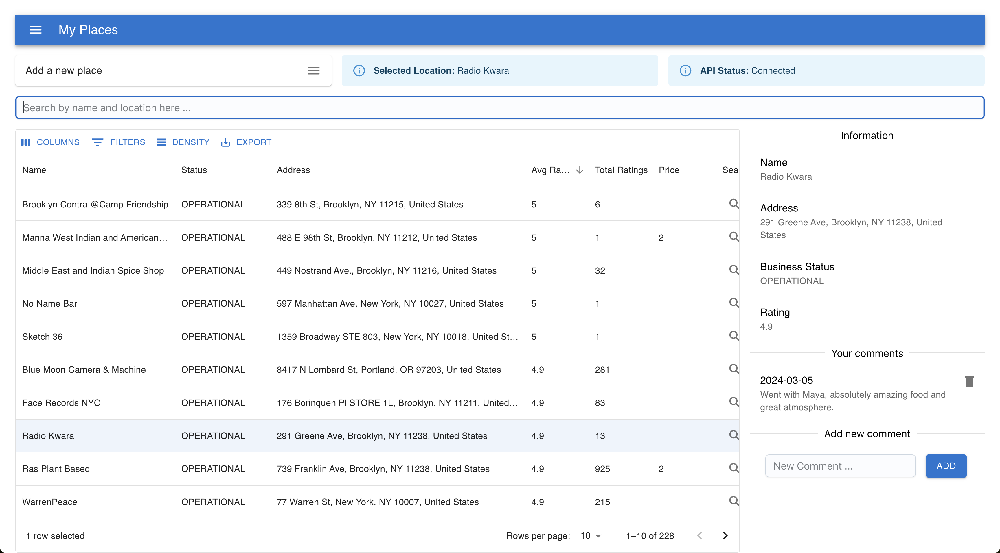

# Info

Personal project to manage my favorite places to go and eat / visit. Requires a free MongoDB Atlas account to run
as well as a Google Maps/Places API key. This should be easy to set up. 



Would be nice to add some integration that would allow me to more easily book reservations using this but the Resy API is really expensive.

## Features

**Current:**
- Browse and search all saved places that you have been to
- Link out to the Google page to more easily make reservations
- Add new places to the list based on name and location (using Google Places API). Duplicates will not be added
- Export the current selection in the table (abides by the current search and sort)

**TODO:**
- Add a map view to see all the places you have been to
- Add a way to add a review to a place
- Add a way to add a photo to a place
- Add a way to add a reservation to a place
- (DONE) Add a remove button
- Bulk import using CSV 

**TODO v2:**
- Add a way to add a place to a list (e.g. "Places to go in NYC")
- (DONE) Add a way to add notes to a place 
- Recipe page for users that want to create a recipe book
- Add a way to add a recipe to a place

# Setup

You will need to have the following installed:
1. Python and Node installed 
3. npm
4. poetry
5. openapi-generator
6. MongoDB Atlas account
7. Google Maps/Places API key

Plus have the following environment variables set:
```bash
export MONGO_DB_URI="<uri>"
export GOOGLE_MAPS_API_KEY="<api_key>"
```

# Back End

## Install Dependencies and Run:

Ensure that you have all the necessary dependencies installed:
```bash
$ poetry install
```

Run the server from directory root:
```bash
$ poetry run uvicorn service:app --reload
```

Start the cache server from directory root with redis installed and running:
```bash
$ brew install redis
$ redis-server --port 6379
```

# Front End

## Generate Client from Service OpenAPI:

Then generate the client (run from root of this project, not the client directory):
```bash
$ poetry run uvicorn service:app --reload
$ openapi-generator generate -i http://localhost:8000/openapi.json -g typescript-fetch -o my-places/src/api
```

## Install Dependencies and Run:

Ensure that you have all the necessary dependencies installed:
```bash
$ cd my-places && npm install && npm run start
```

You will be able to access the front end at `http://localhost:3000`